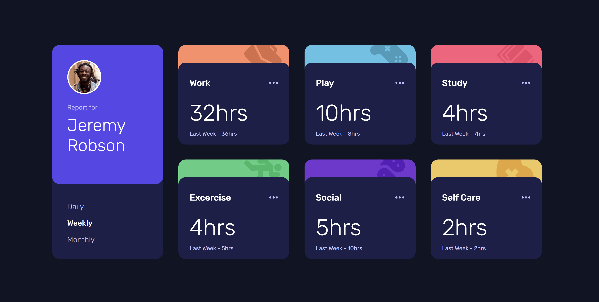

# Quiz 2 - Time tracking dashboard solution

This is a solution to the Time tracking dashboard Quiz 2 challenge

## Table of contents

- [Overview](#overview)
  - [The challenge](#the-challenge)
  - [Screenshot](#screenshot)
  - [Links](#links)
- [My process](#my-process)
  - [Built with](#built-with)
  - [What I learned](#what-i-learned)
  - [Continued development](#continued-development)
  - [Useful resources](#useful-resources)
- [Author](#author)
- [Acknowledgments](#acknowledgments)

## Overview

### The challenge

Users should be able to:

- View the optimal layout for the site depending on their device's screen size
- See hover states for all interactive elements on the page
- Switch between viewing Daily, Weekly, and Monthly stats

### Screenshot




### Links

- Solution URL: [Add solution URL here](https://github.com/GuhD01/time-tracking-dashboard-main/tree/main)
- Live Site URL: [Add live site URL here](https://your-live-site-url.com)

## My process

### Built with

- HTML
- CSS
- JS
- Google fonts


### What I learned

I learn on how to use jquery towards its potential in which I was able to link my website to the data.json file.

CSS:
```css
body {
  align-items: center;
  justify-content: center;
  min-height: 100vh;
  margin: 0;
  display: flex;
  flex-direction: column;
}
```

JS:
```js
function handleClick(event) {
  const selectedPeriod = event.target.id;
  const periods = ['daily', 'weekly', 'monthly'];

  periods.forEach((period) => {
    const elements = document.querySelectorAll(`.${period}`);
    if (period === selectedPeriod) {
      elements.forEach((element) => element.classList.remove("hide"));
      event.target.classList.add("selected");
    } else {
      elements.forEach((element) => element.classList.add("hide"));
      document.querySelector(`#${period}`).classList.remove("selected");
    }
  });
}
```


### Continued development

In future project, I would like to use the knowledge from doing this course to use it on my future projects in which i could use the codes and knowledge i have in my other exercises and others. There are no end in website development so we always need to develop our skills to keep up with others.

### Useful resources

- [Stack Overflow](https://stackoverflow.com/) - This website is one of the most useful websites I have used since my computer science journey started. It contains many resources that I can use, and it has such an amazing community that provides us with coding knowledge that is easy to understand. 
- [Youtube](https://www.youtube.com/) - Everyone has used Youtube at least once in their lifetime. However, many of us have yet to use the highest potential of this application. Youtube contains many HTML, CSS and JS tutorials that could help us expand our knowledge in making a website. There are a lot of free tutors and courses which we can access easily. What makes it better is that everything is free.
## My Detail 

- FullName - Gde Ngurah Randy Agastya
- StudentID - 2602119165
- BINUS Email - gde.agastya@binus.ac.id

## Acknowledgments

I want to thank my friends who guided me in ways to make my code much more efficient. Then, thank Mr. Bagus, our lecturer on HCI, who teaches us a lot about website development. Finally, thank all the websites and software that have been a lot of help for me in this exercise.

